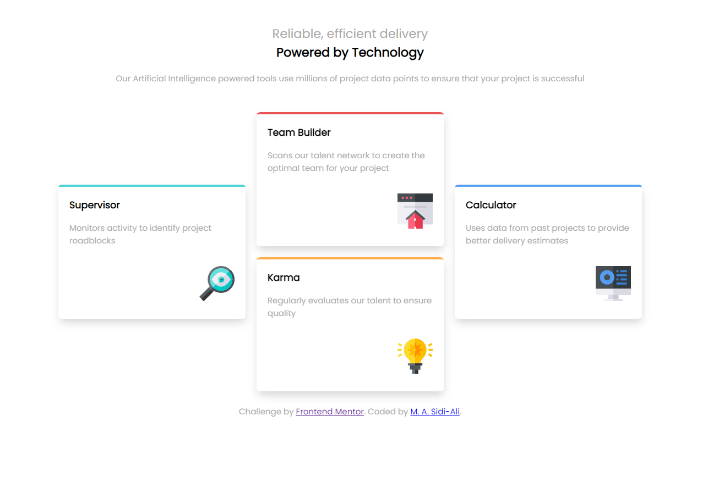
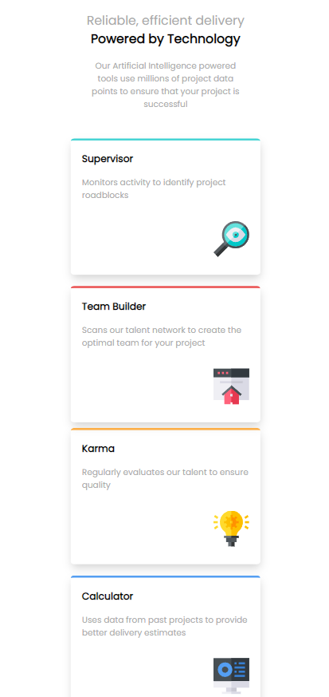

# Frontend Mentor - Four card feature section

This is a solution to the [Four card feature section coding challenge on Frontend Mentor](https://www.frontendmentor.io/challenges/four-card-feature-section-weK1eFYK). Frontend Mentor challenges help you improve your coding skills by building realistic projects.

## Table of contents

- [Overview](#overview)
  - [The challenge](#the-challenge)
  - [Screenshot](#screenshot)
  - [Links](#links)
- [My process](#my-process)
  - [Built with](#built-with)
  - [What I learned](#what-i-learned)
  - [Continued development](#continued-development)
  - [Useful resources](#useful-resources)
- [Author](#author)

## Overview

### The challenge

Users should be able to:

- View the optimal layout for the site depending on their device's screen size

### Screenshot

Below is a screenshot of the desktop version of my solution.

Below is a screenshot of the mobile version of my solution.

### Links

- [Solution](https://github.com/Sidi-Ali/new4card)
- [Live Site](https://sidi-ali.github.io/new4card/)

## My process

I used a desktop-first workflow to complete this project.

### Built with

- HTML
- CSS
- Flexbox

### What I learned

Positioning using Flexbox.

### Continued development

I am going to continue learning frontend Web development.

### Useful resources

- [Flexbox](https://developer.mozilla.org/en-US/docs/Learn/CSS/CSS_layout/Flexbox) -  This helped me to understand how items are arranged in rows and columns.

## Author

- linkedin - [M. A. Sidi-Ali](https://www.linkedin.com/in/muhammad-adamu-sidi-ali-907a486b/)
